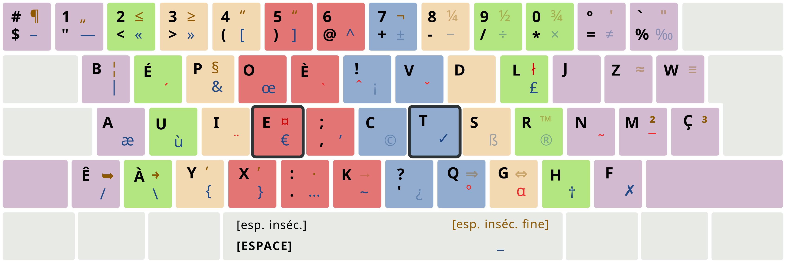

# Étienne's flavour of Bépo keyboard layout

This repo contains my current keyboard layout, as well as install scripts and
some illustrations.

This project adheres to [Semantic Versioning](https://semver.org/spec/v2.0.0.html), and releases descriptions can be found in [`CHANGELOG.md`](https://git.unipart.io/unipart/ubis/src/branch/master/CHANGELOG.md).



## Dependencies

The install script requires [`xmlstarlet`](https://sourceforge.net/projects/xmlstar/).

## Install

To install and load the new keyboard layout, simply run `./install-layout`. To get more details about usage and options, run

```
./install-layout -h
```